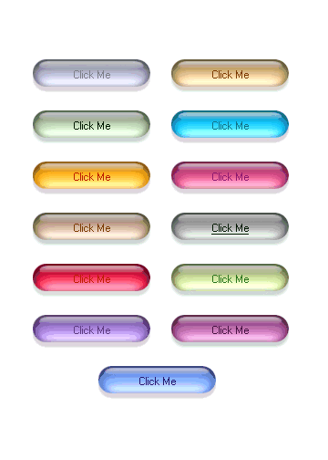



## Easy Bitmap Pill Button \(Nice Look\!\)

### Description

This is my Pill Button with Fade Effect,not a lot of code,but looks nice! I Tried to do something similar to OsX Button,didn't

know how to do it more easy, with bitmaps,with out make the screen to Flicker.
 
### More Info
 

             |
---                |---
**Submitted On**   |2003-02-02 13:16:10
**By**             |[MArio Flores G](https://github.com/Planet-Source-Code/PSCIndex/blob/master/ByAuthor/mario-flores-g.md)
**Level**          |Intermediate
**User Rating**    |4.8 (29 globes from 6 users)
**Compatibility**  |VB 5\.0, VB 6\.0
**Category**       |[Custom Controls/ Forms/  Menus](https://github.com/Planet-Source-Code/PSCIndex/blob/master/ByCategory/custom-controls-forms-menus__1-4.md)
**World**          |[Visual Basic](https://github.com/Planet-Source-Code/PSCIndex/blob/master/ByWorld/visual-basic.md)
**Archive File**   |[Easy\_Bitma153852222003\.zip](https://github.com/Planet-Source-Code/mario-flores-g-easy-bitmap-pill-button-nice-look__1-42903/archive/master.zip)

